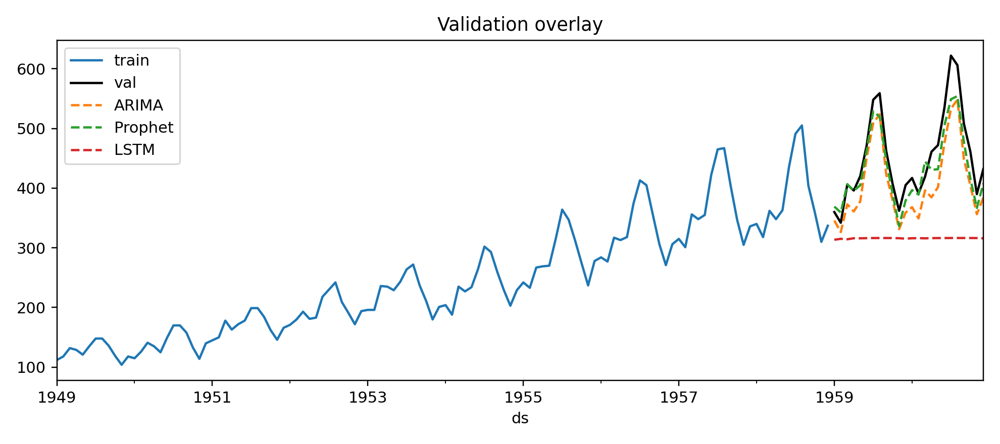
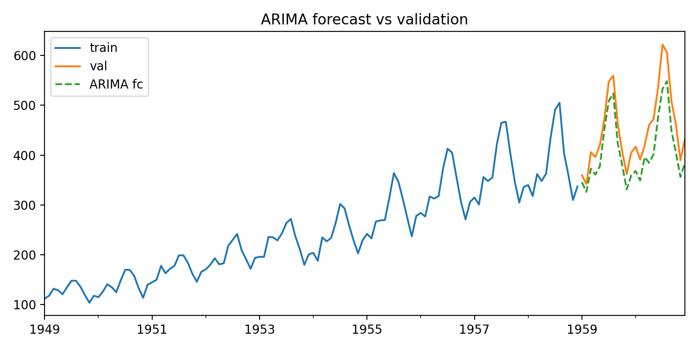
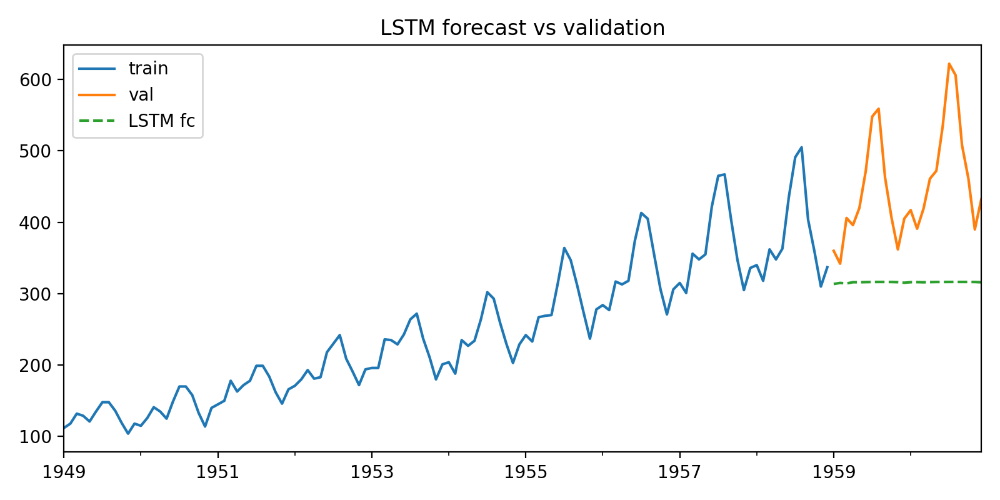

# Demand Forecasting Demo — ARIMA/Prophet vs LSTM

[](
https://colab.research.google.com/github/chibuogwuonyemaechi/time_series_demo/blob/main/demand_forecasting_demo.ipynb
)

This notebook shows a simple time-series workflow:

- Load a monthly series (embedded **AirPassengers**, no internet required)
- Train/validation split
- Classical forecast: **ARIMA** (pmdarima) and optional **Prophet**
- Deep learning forecast: small **LSTM** (TensorFlow)
- Save overlay charts in `outputs/`

## Quickstart

### Local (CPU)
```bash
# (Recommended) create a fresh venv/conda env
pip install -r requirements_timeseries.txt
# or: pip install numpy pandas matplotlib scikit-learn statsmodels pmdarima prophet tensorflow

# Open the notebook
jupyter notebook demand_forecasting_demo.ipynb
```

### Colab
- Upload `demand_forecasting_demo.ipynb` to Colab
- Run the first cell and uncomment the `pip install` line

## Notes
- Prophet and TensorFlow are optional; cells handle missing packages gracefully.
- Swap in electricity/water demand by replacing the data loader cell.

## Results (sample)
<p>
  
</p>
<p>
  
  
</p>
